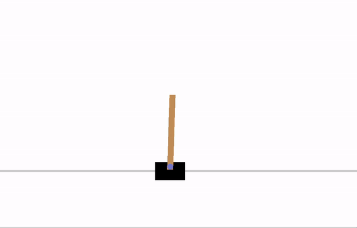

# Lab Exercise: Quantization and Reinforcement Learning on Embedded Systems

## Overview
In this lab, you will train a Proximal Policy Optimization (PPO) agent to solve the `CartPole-v0` environment, convert the trained model for optimized execution on embedded systems using quantization, and generate a C header for deployment on an ESP32-C3.

## Learning Outcomes
Upon completing this lab, students will be able to:
1. Understand the principles behind Proximal Policy Optimization in Reinforcement Learning.
2. Apply model quantization techniques for efficient deployment on edge devices.
3. Convert trained models into a format suitable for embedded systems.

## Table of Contents
1. **Introduction**
    * CartPole-v0 Overview
    * Proximal Policy Optimization
    * Quantization in Deep Learning
2. **Pre-Lab Set-up**
3. **Training PPO on CartPole-v0**
4. **Quantizing the Trained Model**
5. **Generating C Source File for ESP32-C3 Deployment**
6. **Visualizations**
7. **Resources**

---

## 1. Introduction

### CartPole-v0 Overview
CartPole is a classic problem in the field of Reinforcement Learning:
- **Objective**: Prevent a pole attached to a moving cart from falling over.
- **Controls**: Apply forces of +1 or -1 to the cart.
- **Reward**: +1 for every timestep the pole remains upright.
- **Episode Termination**: Pole tilts over 15 degrees from vertical or cart moves over 2.4 units from center.


  
[Details on CartPole-v0](https://gymnasium.farama.org/environments/classic_control/cart_pole/)

### Proximal Policy Optimization
PPO is a policy gradient method with applications in both discrete and continuous action spaces. Key features include:
- **Actor-Critic Structure**: The actor decides actions based on observations, while the critic estimates expected rewards.
- **Policy Update**: Uses trajectory sampling and policy gradient optimization.
- **Value Function**: Optimized via gradient descent.
  


**Further Reading**:
- [PPO Original Paper](https://arxiv.org/pdf/1707.06347.pdf)
- [OpenAI Spinning Up PPO Documentation](https://spinningup.openai.com/en/latest/algorithms/ppo.html)

### Quantization in Deep Learning
Quantization compresses neural network models, enabling efficient inference on edge devices. This reduces the memory footprint and boosts computational speed, making it vital for deployment on resource-constrained hardware like ESP32-C3.

---

## 2. Pre-Lab Set-up

Ensure the following libraries are installed:
- `numpy`: Handling n-dimensional arrays.
- `tensorflow` & `keras`: Building the deep RL PPO agent.
- `gym`: Setting up the CartPole environment.
- `scipy.signal`: Calculating discounted cumulative sums.

---

## 3. Training PPO on CartPole-v0

Navigate to `./scripts/RL_cartpole/PPO_cartpole/` and run the `cartpole_ppo_keras.py` script to start training.


## 4. Quantizing the Trained Model

### Why Quantization?

Edge devices typically have limited computational resources, making it difficult for them to run large, floating-point Deep Neural Network (DNN) models efficiently. Quantization addresses this by converting the model's weights and activations from floating-point values into 8-bit integers. This process significantly reduces the model's size and accelerates its inference speed. However, it's important to note that this comes at the expense of slight accuracy degradation.

### Representative Sampling

For quantization to work well, TensorFlow requires a representative dataset. This dataset provides a distribution of input values the model will likely encounter in the real world. TensorFlow uses this data to determine the best way to map floating-point values to 8-bit integers.

```python
def generate_tflite(model, name="quant.tflite", buffer_size=500):
    # Sampling data for representative dataset
    x_values = [buffer.observation_buffer[i] for i in random.sample(range(buffer_size), buffer_size)]
    
    def representative_dataset():
        for i in range(buffer_size):
            yield [x_values[i]]

    # Convert the model
    converter = tf.lite.TFLiteConverter.from_keras_model(model)
    converter.optimizations = [tf.lite.Optimize.DEFAULT]
    converter.target_spec.supported_ops = [tf.lite.OpsSet.TFLITE_BUILTINS_INT8]
    converter.inference_input_type = tf.int8
    converter.inference_output_type = tf.int8
    converter.representative_dataset = representative_dataset
    tflite_model = converter.convert() 

    with open(name, "wb") as f:
        f.write(tflite_model)
```

In our given function, this process is captured by the following code:

```python
# Sampling data for representative dataset
x_values = [buffer.observation_buffer[i] for i in random.sample(range(buffer_size), buffer_size)]
```

Here's what's happening:

- We randomly sample `buffer_size` observations from the `buffer.observation_buffer`.
- These sampled observations form the representative dataset.

### Importance of Representative Sampling

#### Range Determination

During quantization, each floating-point number is mapped to an integer. This mapping requires determining the range (minimum and maximum values) of the data. If the representative dataset isn't truly representative, the determined range might be too small or too large, causing the model to either saturate or use a non-optimal range, respectively. This can lead to significant accuracy drops.

### Implications of Non-representative Samples

1. **Loss of Accuracy**: Non-representative samples might result in TensorFlow not capturing the true data distribution. This can lead to considerable accuracy degradation post-quantization. For example, if the model is supposed to recognize a range of colors but is only provided with grayscale images during sampling, the quantized model might fail when exposed to colored images.

2. **Data Saturation**: If the sampled data doesn't capture the extreme values the model might encounter, the quantization process might clip values beyond the sampled range, causing a saturation effect.

3. **Suboptimal Utilization**: If the representative dataset has outliers or doesn't capture the general distribution well, TensorFlow might choose non-optimal mappings, wasting some of the 8-bit range.

### Conclusion

In essence, quantization is a crucial step for deploying models to edge devices. However, its success heavily relies on having a representative dataset. By ensuring this dataset is truly representative of real-world scenarios, we ensure that the quantized model remains accurate and robust.


---

## 5. Generating C Source File for ESP32-C3 Deployment

Embedded devices often lack a file system. To access the serialized model data, we'll convert it into a C array and compile it into the executable, storing it in Flash:

```bash
python3 gen_tflite_c_array.py actor_quant.tflite ./files/actor_quant_model_data.cc
```

**Why this step?**  
Unlike laptops or desktops, embedded devices don't access models through filesystems. They require the tensorflow-lite model to be part of the program itself, so it gets converted to a C source file.

---

## 6. Visualizations

**Early Training Stage**:  


**Later Training Stage**:  


---


